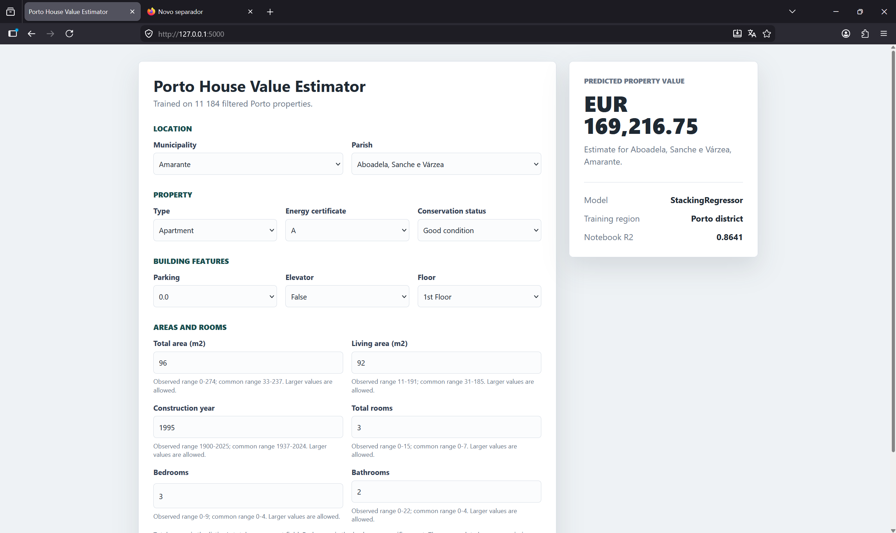

# IA-Project-2



A web-based machine learning application that predicts residential property values in the Porto district using a stacked ensemble regression model.

## Project Description
This web app provides data-driven real estate valuations by analyzing local property characteristics such as location, area, room count, and building features. 

The underlying machine learning core utilizes a `StackingRegressor` composed of five powerful base estimators (`ExtraTreesRegressor`, `RandomForestRegressor`, `HistGradientBoostingRegressor`, `XGBRegressor`, and `LGBMRegressor`) optimized with a `Ridge` meta-regressor. The system includes an automated data cleaning and outlier removal pipeline that trains on historical property entries to ensure robust, accurate predictions. A Python Flask backend exposes the trained model via a REST API, which is served to an interactive, responsive front-end interface.

## Quick Start with Docker

The entire pipeline—including data processing, model training, and web serving—is fully containerized. You do not need to install Python or machine learning libraries locally.

### How to use Docker to run

Run the following commands from the project root directory and then go to http://localhost:5000:
```bash
docker build -t estate-estimator:latest
docker run -d -p 5000:5000 --name porto_app porto-estimator:latest
```

### How to run locally

If you prefer to run the application natively on your host machine:
```bash
pip install -r requirements.txt
python web_app/train_model.py
python web_app/app.py
```